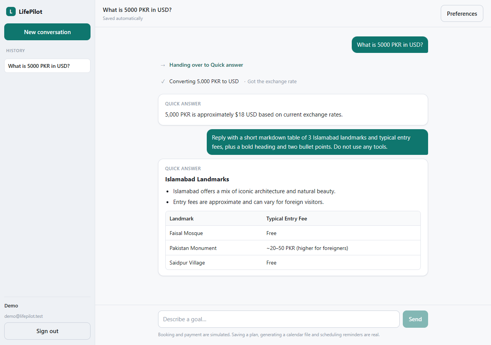
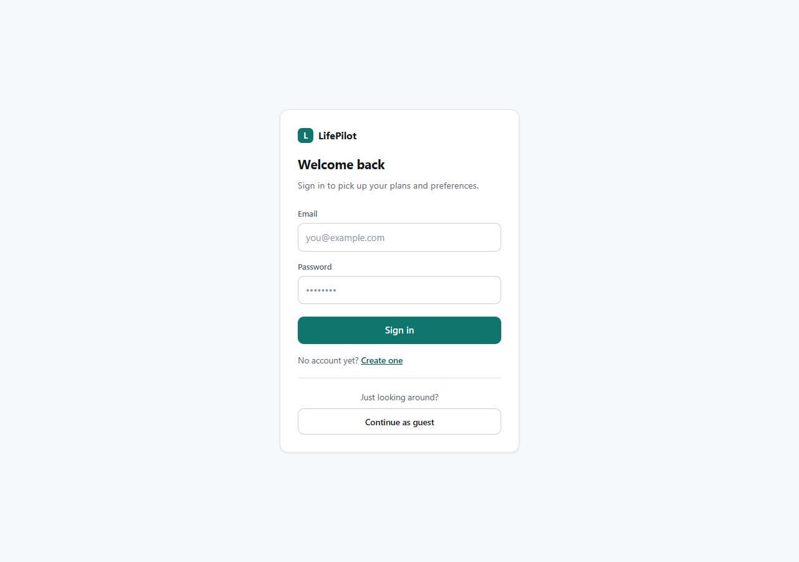
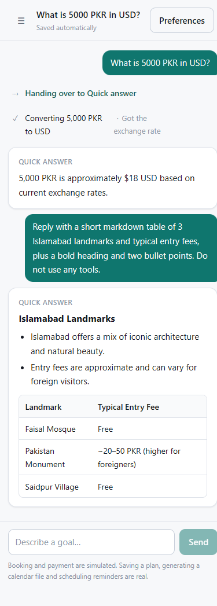

# LifePilot

A multi-agent personal planning assistant built on **Google ADK for TypeScript**.

Describe a real goal in plain language — *"plan a weekend in Islamabad under
20,000 PKR"*, *"help me buy noise-cancelling headphones"* — and an orchestrator
routes it to the right specialists. They research it in parallel, cost it, put it
in order, check each other's work, and then **stop and ask before doing anything
consequential**.

> **Status:** Phases 0–7 of 8 complete and verified against live APIs.
> Remaining: prompt-cache measurement and the final write-up.
> Build plan and reasoning: [docs/PLAN.md](docs/PLAN.md).



---

## What this is meant to prove

Four things, live rather than described:

1. **Real orchestration** — an `LlmAgent` that *decides* which specialists run, not a fixed pipeline
2. **Real tools** — actual API calls returning real data, never stubs
3. **Model routing** — one agent graph across several providers, with automatic failover
4. **Human-in-the-loop** — a run that genuinely halts, then acts autonomously later

It also runs on **almost nothing**: every service has a free tier, and the
deployed demo's happy path spends $0.

---

## Architecture

```
                        orchestrator  (LlmAgent — decides, does not answer)
                              │
        ┌─────────────────────┼─────────────────────┐
        ▼                     ▼                     ▼
   quick_answer         commit_agent          lifepilot_graph
   one lookup,          asks approval,        the full pipeline
   one answer           then acts                    │
                                                     ▼
                                        intake ─ reads memory, writes a spec
                                                     │
                                        ParallelAgent ─ 4 researchers at once
                                        web · places · context · price
                                                     │
                                        SequentialAgent ─ recommend → budget → plan
                                                     │
                                        LoopAgent ─ verify and revise, ≤2 passes
                                                     │
                                        presenter ─ renders the answer
```

**Models are assigned by task shape, not uniformly.** Routing is classification,
so the orchestrator runs on Flash-Lite. Research fans out four ways, so it runs
on Flash-Lite too. Judgement work runs on Flash. The **verifier deliberately runs
on a different provider from the agents that wrote the plan**, so its critique
cannot be self-confirming — a better argument for multi-provider support than
"we support many models".

Every tier has a fallback chain, and fallbacks are matched to context size:
Groq's free tier caps a request at 8,000 tokens, so it backs the small fan-out
agents and never the late pipeline agents that carry 12k of findings.

---

## Stack

| Layer | Choice |
|---|---|
| Agents | `@google/adk` **1.6.0**, pinned exact |
| LLM | Gemini 3.6 Flash / 3.5 Flash-Lite, plus Groq · DeepSeek · OpenRouter |
| Multi-provider | A hand-written `BaseLlm` adapter — ADK-TS ships no non-Gemini models |
| API | Node 22 · TypeScript strict · Hono · SSE |
| Web | Next.js App Router, hand-written CSS |
| Auth | scrypt password hashing + HMAC-signed tokens (`node:crypto`) |
| Data | Neon Postgres via ADK `DatabaseSessionService` |
| Contracts | Zod schemas shared by API **and** web |

---

## Quick start

```bash
npm install
cp .env.example .env          # every key is free; links are in the file
npm run build --workspace @lifepilot/shared
npm test

npm run dev --workspace @lifepilot/api    # API → :8080
npm run dev --workspace @lifepilot/web    # web → :3100
```

### From the terminal

Every layer runs without the UI, which is how it was built and debugged.

```bash
# individual tools — no agent, no LLM in the loop
npm run tool -- weather Islamabad 3
npm run tool -- places Islamabad cafe 3000 5
npm run tool -- currency 20000 PKR USD

# agents
npm run agent -- "what is 5000 PKR in USD?"                 # orchestrator
npm run agent -- --graph "plan a weekend in Islamabad"      # full pipeline
npm run agent -- --baseline "plan a weekend in Islamabad"   # Phase 1 control
npm run agent -- --model groq/openai/gpt-oss-120b "..."     # another provider

# the approval gate
npm run approve -- list
npm run approve -- approve <approvalId>
npm run tick                                                # fire due reminders
```

---

## The parts worth reading

**`apps/api/src/models/openai-compatible.ts`** — ADK for TypeScript ships model
classes for Gemini and Apigee only, and LiteLLM (the Python escape hatch) has no
TS equivalent, so multi-provider support meant implementing `BaseLlm` directly.
One adapter covers Groq, DeepSeek and OpenRouter. The HTTP call is the easy part;
the work is translating between genai's `Content` and OpenAI's message and
tool-call shapes in both directions, and converting Gemini's schema dialect into
strict JSON Schema.

**`apps/api/src/tools/approval.ts`** and **`src/memory/approvals.ts`** — the
human-in-the-loop gate. The run genuinely suspends, the decision lives in
Postgres, and the gate is enforced in code rather than only in the prompt: an
agent that forgets to ask still cannot act.

**`packages/shared/src/schemas.ts`** — one set of Zod schemas feeding ADK's tool
declarations *and* the web app, so the two cannot drift.

**`apps/web/app/lib/activity.ts`** — the agent stream is engineering output:
`transfer_to_agent`, argument objects, internal agent names. This turns it into
sentences a person would want to read ("Checking the 3-day forecast for
Islamabad"), folds results into the call that produced them, and keeps the raw
payload one click away. Transparency is better served by this than by the JSON.

---

## Tool layer

All verified against live APIs; latencies are measured, not estimated.

| Tool | Provider | Free tier | Latency |
|---|---|---|---|
| `weather` | Open-Meteo | no key needed | ~1.7 s |
| `currency` | ExchangeRate-API | no key needed | ~0.4 s |
| `geocode` / `places` | Geoapify | 3,000 credits/day | ~0.9 / 1.3 s |
| `search` | Tavily | 1,000 credits/month | ~2.5 s |
| `products` | Tavily, retail-scoped | shares search quota | ~3.9 s |
| `preferences` | Postgres | — | ~5 ms |

Three rules the tool layer holds to:

**Nothing is substituted for missing data.** Where a provider returns null, the
tool returns null. An early version coalesced a missing temperature to `0` and
reported 0 °C in Islamabad in September — a plausible number no downstream check
could catch.

**No LLM runs inside a tool**, so no tool result can be invented. `products`
returns listings with `priceApprox: null` rather than guessing a price from a
title.

**Tools never throw across the agent boundary.** They return
`{ ok, data | error }`, because a model recovers from an error object far better
than a `ParallelAgent` branch recovers from an exception.

---

## Deployment

| Piece | Host | Notes |
|---|---|---|
| API | HF Spaces (Docker) or Render | `apps/api/Dockerfile`; only `/tmp` is writable |
| Web | Vercel | set `NEXT_PUBLIC_API_URL` to the API origin |
| Database | Neon | free tier, scale-to-zero |
| Scheduler | GitHub Actions | `.github/workflows/tick.yml`, every 15 min |

The scheduler is an **external** cron on purpose. Free-tier hosts sleep, so an
in-process timer would not fire late — it would not fire at all, and the
autonomous behaviour that justifies the approval gate would quietly stop
existing. The ping drives the schedule and wakes the host in one move.

Set `API_URL` and `TICK_SECRET` as repository secrets. `/tick` fails closed: no
secret configured, no execution.

---

## Honest limitations

Kept here deliberately. A portfolio project that hides its edges is a tutorial.

- **Authentication is deliberately simple.** Real accounts with scrypt-hashed
  passwords and HMAC-signed tokens, written against node:crypto rather than
  pulled from a dependency — but there is no email verification, no password
  reset and no rate limiting on sign-in. Those are the next things to add before
  anyone should trust it with real data.
- **Place data has no ratings, reviews or photos** — an OpenStreetMap
  consequence, surfaced to the agents rather than papered over, so ranking
  questions go to web search instead of being invented.
- **Product prices are not extracted yet.**
- **Booking and payment are simulated** and labelled as such. Saving a plan,
  generating a calendar file and scheduling reminders are real.
- **Google Calendar writes are deliberately absent.** `calendar.events` is a
  sensitive scope: an unverified app shows a security warning and is capped at
  100 users for the project's lifetime, which would break "a stranger with a link
  can finish the flow". An `.ics` file needs no scope at all.
- **The free tier is the binding constraint.** Gemini's free quota is per model
  per day and is easy to exhaust while developing. Model ids are pinned, because
  `gemini-flash-latest` had drifted onto a model with a 20-requests-per-day cap.
- **The Phase 3 comparison is unfinished.** The graph is demonstrably stronger at
  research than the single-agent baseline — 7 tool calls including three real
  place lookups, against 3 and none — but a clean end-to-end judgement is still
  pending. The baseline is kept in `docs/baselines/` so the claim stays testable.

---

## Screenshots

| Sign in | Desktop | Mobile |
|---|---|---|
|  |  |  |

---

## Documentation

| Document | What it is |
|---|---|
| [docs/PLAN.md](docs/PLAN.md) | Decisions, costs, architecture, phases, risks |
| [docs/WORKFLOW.md](docs/WORKFLOW.md) | The review/verify pipeline used to build it |
| [docs/baselines/](docs/baselines/) | Saved outputs the agent graph is measured against |
